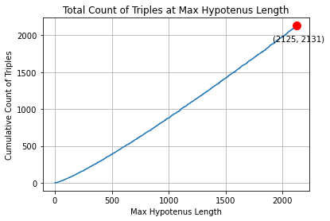
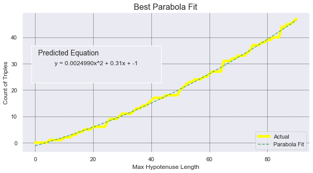
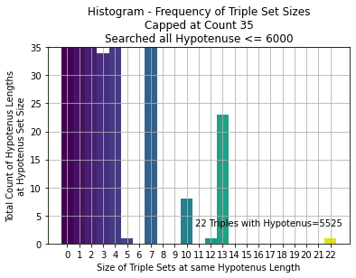

[](https://classroom.github.com/a/isKGJtbV)
# HW6 - Spell Checker

## Overview
**Learning objective:** Implement efficient code with generators. 

You will want to read through the assignment thoroughly. Understand the context and methods you're implementing. There are _tips_ and _resources_ available to help you succeed - **take advantage of them!!**

- [Context](#context)
- [Files & Requirements](#files--requirements)
  - [Provided Files](#provided-files)
  - [Submission Guidelines](#submission-guidelines)
  - [Passing Tests](#passing-tests)
  - [Rubric](#rubric)
- [Your Assignment](#your-assignment)
  - [Part 1: Implementing Spell Checking](#part-1---implementing-spell-checking)
  - [Part 2: Generators](#part-2---generators)
     - [Mis-misspelled](#mis-misspelled)
     - [Part 2a: _insert_letters](#part-2a---_insert_letters)
     - [Part 2b: _remove_letters](#part-2b---_remove_lettters)
     - [Part 2c: _swap_letters](#part-2c---_swap_letters)
  - [Part 3: Suggesting Corrections](#part-3---suggesting-corrections)
     - [suggest_mismisspellings](#suggest_mismisspellings)
     - [Composing](#composing)
  - [Part 4: Levenshtein Algorithm](#part-4---levenshtein-algorithm)
  - [Part 5: Wrapping Up](#part-5---wrapping-up)
     - [Python Module](#python-module)
     - [Final Output](#final-output)
- [Resources](#resources)
- [Challenge Question (OPTIONAL)](#challenge-question)
  - [ChatGPT & Plagarism](#chatgpt--plagiarism)
  - [Pythagoran Triples](#pythagorean-triples)
  - [Coding Hints](#coding-hints)
  - [Graphs with Insight](#graphs-with-insight)
  - [Draw some Conclusions](#draw-some-conclusions)


## Context
You will be creating a program whose function is to determine misspelled words from a file. It will also provide a set of suggested corrections. This is similar to the project SpellChecker from AP CSA, but we will be focusing more on efficiency, objects, and providing suggestions is now a **requirement.**

In this project you will learn:  
* Class implementation (should just be extra practice by now)
* The importance of efficiency
* How to implement spelling suggestions using `Levenshtein Distance`
* How to implement a `generator`

All of these things will accomplished by implementing a `SpellChecker` class.

Your Spell Checker program will be given a list of words to use as its dictionary.
The primary pieces of functionality will be to:  
* Create a collection of words as your reference dictionary (text file)
* Determine if a single word is misspelled
* Find all the misspelled words in an _essay_ (text file)  
* Provide a set of correctly spelled words as suggested corrections

A basic infrastructure of the SpellChecker class will be provided, but you will need to implement the methods.

## Files & Requirements

### Provided Files
* `data/`: A directory containing provided files for you to use.
   * `englishEssay.txt`: The file whose contents that you will be checking for misspelled words.
   * `wordList.txt`: A list of correctly spelled words that you will be using as your dictionary to see if a word is misspelled.
   * `smallEssay.txt`: A smaller file of content that you can use for ensuring your code works on a smaller scale.
   * `wordSmall.txt`: A smaller set of words to use as a dictionary in conjunction with `smallEssay.txt`.
* `test/`: A directory for you to provide any files for you to use as your tests.
   * Note that writing your own tests is NOT required. So it is possible that you will leave this empty.
* `main.py`: Initializes a SpellChecker object to find all the misspelled words in a file's contents and provide suggestions for those words.
   * The file has the `time` library imported. This is used to determine how fast your code checks the spelling. Note that it will change every time you run the program - there's some variation!
   * At first, you will not implement the suggestions. But it should be there by the end! (See [`Final Output`](#final-output).)
* `spell_checker.py`: A class that handles caching the dictionary words and provides a method `spell_check` to then check the spellings of words in a file.
   * So, the constructor takes a file name for the dictionary text file. Then the `spell_check` method takes in a different file name, which is the one that is checked.
   * All other methods have docstring comments with descriptions provided for you. Ensure that you maintain good class design.
* `word_info.py`: A class that contains info on an individual misspelled word.
   * `self._misspelled`: The word that is misspelled.
   * `self._line`: The line number that the misspelled word was found.
   * `self._word_number`: The number of the word in the overall file.
   * `self._suggestions`: A list of words that are suggested corrections for the misspelled word.
      * Note that this parameter is not required (it is a default parameter). This is because you will not implement suggestions at first.
* `levenshtein.py`: A file containing two methods implementing the Levenshtein Distance algorithm. You will read more about it in this assignment.
* `cse163_utils.py`: A file containing methods to help write tests (if you need them), comparing if objects are equal.
* `challenge_questions.md`: A file that you can write down answers to this assignment's Challenge Question in. Note that filling out this file is OPTIONAL, since the challenge question itself is not mandatory.

### Submission Guidelines
* You must submit your work as your teacher requires. Ask questions in class.   
* You will be graded on:
    * Functionality  
    * Speed/Efficiency
    * Class design (ex: "private" methods)
        * Note that Python does not enforce private methods. Convention is to put an underscore at the start of a name of a private method.
    * Passing all Unit Tests.
* **You will not be graded on any commenting or tests you write.**

### Passing Tests
You will need to pass the required Unit Tests for this assignment. If they are failing, try writing your own tests.  You should understand the input
and expected output of your own tests. This will assure that things are working
according to plan. 

If you are not passing the speed checks, there may be several factors. **Verify that the data structure you're using to hold the dictionary is fast.** Also ensure that you are not doing any unnecessary looping.

It may also be that your output is formatted wrong. You will notice that the output in `main.py` has padding (spacing) around the line number, misspelled words, etc. The easiest way to do this is with `f-strings` - see the resources!

You will also need to understand how to use generators for this assignment. Once again, take a look at the resources!

### Rubric
I'll convert the XML rubric into a table format, incorporating both sets of feedback.

| Category | A  | B | C | F
|----------|-------------|------------|------------|-----------|
| Functionality (50% of grade) | All features work correctly; Proper output formatting; Original implementation; Handles all edge cases (hyphenated words, multiple suggestions); spell_check returns correct WordInfo objects; Clear code citations with explanations | Most features work; Minor formatting issues; Handles common cases; Some edge cases may fail; Proper function parameters | Several features not working; Major formatting issues; Missing required parameters; Edge cases not handled; Unclear citations | Critical features missing or broken; No output formatting; Code heavily borrowed without citation; Function signatures incorrect |
| Concepts, Design & Conventions (25% of grade) | Appropriate helper methods; Proper encapsulation (private/public); Clean printing implementation; Complete docstrings; Excellent f-string usage; Clear variable names; Optimal line lengths | Most methods documented; Good code organization; Reasonable variable names; Some helper methods; Minor convention issues | Missing helper methods; Poor encapsulation; Missing docstrings; Inconsistent formatting; Printing in wrong classes | No helper methods; No documentation; No adherence to conventions; Poor code organization; No encapsulation |
| Efficiency (25% of grade) | Meets all speed requirements; Optimal algorithm implementation; Efficient data structures; Smart handling of max limits; No unnecessary processing | Minor inefficiencies in algorithms; Generally good performance; Some unnecessary processing; Reasonable data structure choices | Failed speed requirements; Inefficient storage/processing; Continues past max limits; Poor algorithm choices | Extremely inefficient implementation; No consideration for performance; No optimization attempts |

Additional Notes:
- Late submissions capped at 80% maximum
- Academic integrity violations will result in additional penalties
- All code must pass provided test cases
- Citations must include detailed explanations of usage

Assignment Details:

- Original Assigned: January 14, 2025

# Your Assignment

## Part 1 - Implementing Spell-Checking
The first part of this assignment will be similar to AP CSA's `SpellChecker` assignment. We will first implement the functionality to check the spelling of all the words in an essay (represented as a `.txt` file), but this time using objects in Python!

You will implement the following three methods in the class `SpellChecker`:
1) `__init__(self, dictionary_name)` : Takes the name of a dictionary and initializes a SpellChecker object.  
2) `misspelled(self, word)` : An instance method that returns True if the word is not found in the dictionary. (i.e. misspelled)
   * Note that this must work with hyphenated words with multiple hyphens (ex: `word-is-good-now` is correctly spelled).
   * The easiest way is with a slick, recursive approach. Break hyphenated words into individual words and recheck.
3) `spell_check(self, file_name, suggest=False)` : An instance method that returns a list of `WordInfo` objects for each misspelled word found in the essay. You will have an optional argument `suggest` that is defaulted to False. If True, the spell check will return suggestions for correctly spelled words (Do not worry about this for now, you will be implementing this later). 

You will also implement `main.py` that will create the SpellChecker object and output the misspelled words from the list of WordInfo objects provided from `spell_check`.
* Your WordInfo object should have `__str__` implemented so it is easy to print; reference the output below

There are Unit Tests (specifically: `check_essay` and `misspelled`) that are related to the above that you **should pass
before continuing onto the next step.** Note that the speed of execution is IMPORTANT; you MUST have _FAST_ code!!. 
**If you are too slow, you will get marked down.**

The output printed to the console for `spell_check` using the file `englishEssay.txt` should look like:

```
    civalized: line:   1  word:  3
 oportunities: line:   6  word:  4
       seeems: line:  15  word:  9
        peopl: line:  21  word:  8
    ettiquitt: line:  35  word:  1
       shoudl: line:  37  word:  7
   psudo-code: line:  37  word: 10
    algorythm: line:  39  word:  6
```
_Look at the spacing in the output. You must have padding!!_

## Part 2 - Generators
Your next task will be to suggest words for the misspelled words found. 

This is where the project starts to get more interesting. There are many creative ways 
to suggest words for a misspelled word.
We will start simple and slow (this solution is very inefficient) and then build up to _AMAZING and FAST!_

You will implement the following three methods as **generators**:  
1) `_insert_letters`: [Part 2a](#part-2a---_insert_letters)
2) `_remove_letters`: [Part 2b](#part-2b---_remove_lettters)  
3) `_swap_letters`: [Part 2c](#part-2c---_swap_letters)


You probably don't know what generators are. READ about them in [`resources/api/generators.md`](resources/api/generators.md) and LEARN how they work before continuing! Ask _questions_ if you need help! **You must understand what they are before continuing with this part.**

After you are done with this part, you should be passing the Unit Tests `insert_letters`, `remove_letters`, and `swap_letters`.
 

### Mis-misspelled
We will start with a concept that we'll call `mis-misspelled`. The basic idea 
is that we will modify the spelling of a misspelled word until
it is modified into a correctly spelled word.  

For example: Let's consider the misspelled word, `aple`. If we modify `aple` by 
introducing another `p` into the '3rd' position (after the second letter) then
we will generate the word `apple` which is correctly spelled! 

Using this concept, we could have the following code, essentially generating every combination possible:   
```python
def get_suggestion(self, misspelled_word):
    for mis_misspelled_word in create_misspelling(misspelled_word):
        if not misspelled(mis_misspelled_word):
            return mis_misspelled_word
```

> IMPORTANT: In order to allow us to "compose" our misspellers together, we need each
> generator to first yield the word without any modifications. **You need to do this to pass tests!!**

### Part 2a - _insert_letters
This generator will insert all the letters, a-z, into every possible
position of a given word, at the start, between each letter, and at the end.
**Remember, the very first word to yield is the word unchanged.**

For example, if we have the word `cat`, the words generated would be:
```python
for word in self._insert_letters('cat'):
    print(word)

# prints
cat
acat
bcat
ccat
dcat
...
ycat
zcat
caat
cbat
ccat
cdat
...
czat
caat
cabt
cact
cadt
...
cazt
...
cata
catb
catc
...
catz
```

Be sure you pass the Unit Test `insert_letters`.

### Part 2b - _remove_lettters
Implement another generator to remove all letters, one letter at a time. 
**The first word the generator will yield, is the word unchanged.**
```python
for word in self._remove_letters('goodbye'):
    print(word)

# prints
goodbye
oodbye
godbye
godbye
goobye
goodye
goodbe
goodby
```

Be sure you pass the Unit Test  `remove_letters`.
  
### Part 2c - _swap_letters
Implement another generator to change all letters, one letter at a time. 
**Once again, the first word to yield is the original word, unchanged.**
Note that this does NOT mean that two letters in the word are swapped. Instead, it means that one letter is
swapped out for another. For example: 
```python
for word in self._swap_letters('ab'):
   print(word)

# prints 
ab
bb
cb
db
eb
fb
gb
...
yb
zb
aa
ac
ad
ae
af
ag
...
ay
az

```

Be sure you pass the Unit Test `swap_letters`.

## Part 3 - Suggesting Corrections

### suggest_mismisspellings
This method should return a list of suggested words that could be the correct
spelling for the misspelled word. The list will have a maximum number
of words added to the list which is specified in the optional `max` argument.

```python
    def suggest_mismisspellings(self, word, max=6):
        # student's implementation goes here
```
### Composing
Each `generator` above catches some type of mistake, but not all of them.
If you try all three back-to-back-to-back, you won't catch many misspellings because some
misspelled words require ALL THREE at the SAME TIME!! For example, to
identify the correctly spelled word `etiquette` from `ettiquitt` it requires
that we delete a `t`, add an `e`, and change an `i` to an `e`. All three!!

We want to implement all 3 types composed with one another. This can be
very difficult. A common approach would be to use recursion to get call
combinations of the generators composed together. This is even more difficult
because of the way generators work--you don't _call_ them, you _iterate_ through them.

We will avoid recursion because we have a small, fixed number of generators that we want to compose.
Instead, you'll simply use nested for-loops to get all possible combinations of mismisspellings.
> Note: This is why we had each generator first return the word unchanged: we want the ability
> to apply _ONLY_ `_insert_letters`. Having our other two mismisspellers return the word
> unchanged allows us to write simple code to find mismisspellings when there is only one mistake.

Be sure you pass the Unit Test _suggest_compose_. This tests that `suggest_mismisspellings` correctly finds a suggestion for a misspelled word that requires all three misspellings. 

Using the above code, you may want to see if you can correctly produce at least one suggestion
for each of the misspelled words in `englishEssay.txt`. However, this method of finding suggestions is very slow.

> Note: Your code may run for as much as a full minute to find suggestions for all
> the misspelled words in the englishEssay.txt.

## Part 4 - Levenshtein Algorithm

### Levenshtein Distance
There are two problems with what we've done so far:  
1) It's too slow!!  
2) The list may contain lots of odd words  

You will now implement `suggest_corrections(self, word)`. It uses a distance algorithm and
is a much _FASTER_ way to find a list of correctly spelled words. 

We are going to change the approach to solving this _suggestion problem_. We
will essentially go backwards. Instead of generating mis-misspelled candidates
and then search the dictionary to see if it is indeed a correctly spelled word,
we will compare 'every' word in the dictionary against the misspelled word
to calculate how 'close' it is to our misspelled word. We will use the Levenshtein Distance algorithm for this.  

Your method will identify the closest distance that any word is to the misspelled word.
It will return a sorted list of all the words at that minimum distance from the misspelled word. 
It will suggest all of the 'closests' words and only the closest words.  

For example, if the misspelled word is `compewter`, your code should return the suggested
list `['compester', 'competer']` because each of these is a distance of 1 away from the
misspelled word `compewter`. The word `computer` is a distance of 2 and will not be included.  

To accomplish this, we need a way to _measure the 'distance'_ between two words. 
The `Levenshtein Distance` algorithm is exactly what we want. Here's a definition for it:
> The Levenshtein Distance algorithm, also known as the edit distance, is a measure of the similarity between two strings.
It calculates the minimum number of single-character edits (insertions, deletions, or substitutions) required to transform
one string into another. The smaller the Levenshtein Distance, the more similar the strings are.

The algorithm will
provide an integer number that is essentially the count of changes made to one
word to reach the other. The changes are exactly the same three generators you
implemented in Part 2 - but **it will NOT use your generators.**

You will add a new instance method, `suggest_corrections` to the SpellChecker class.
```python
# in file spell_checker.py
def suggest_corrections(self, word):
    '''
    Return a list of all the suggest words that share the same, minimum
    distance from word using the levenshtein distance algorithm.
    '''
    # use levenshtein distance to find suggestions
```

It can take a while to understand the algorithm which can take us off topic
quite a bit. So, instead, you will search the internet to find an implementation
of the Levenshtein Distance algorithm. Add it to the file `levenshtein.py`. You will do this
two ways. The first way is to find the Python code on the internet. You will implement:  

```python
# This is in the file levenshtein.py
def levenshtein_distance(s1, s2):
    # Find internet code to return the distance between s1 & s2
    pass
```
Attempt to find _FAST_ implementations. It is pretty clear that some implementations are much faster than others. **You should not be using a library for this step. It must be an algorithm implemented without libraries.**

Write a few tests to verify that your implementation works. 

## Part 5 - Wrapping Up

### Python Module
After you have Python code that correctly implements Levenshtein Distance, look for a Python module that implements the same thing. Wrap up the module's implementation in `levenshtein.py` in the method `lev_distance`.   
* To be clear: `levenshtein.py` has TWO methods. BOTH should return an integer representing the distance.
    * `levenshtein_distance` is the algorithm from Part 4 that does NOT use a library.
    * `lev_distance` utilizes a library for a very fast implementation.

Be sure you pass all the Unit Tests.

### Final Output
You will update `main.py` to run your Spell Checker to output suggestions. Run `spell_check` on the `englishEssay.txt` file and see how fast it finds spelling suggestions. In other words, update `main.py` to call `spell_check(essay, True)` and then print out suggestions beneath the misspelling summary as shown below. **You must follow the formatting shown below. Keep in mind that your time may be different and will vary on each compilation.**

Compare the speed of the Python implementation to the module implementation by doing a spell_check using each. The solution code showed that the Python implementation took 50.5 seconds and the module implementation took less than 2.5 seconds. Amazing, right?!

```
Dictionary: data/wordList.txt
Essay to check: data/englishEssay.txt
Time to spellcheck: 3.012
      civalized: line:   1  word:  3
   oportunities: line:   6  word:  4
         seeems: line:  15  word:  9
          peopl: line:  21  word:  8
      ettiquitt: line:  35  word:  1
         shoudl: line:  37  word:  7
     psudo-code: line:  37  word: 10
      algorythm: line:  39  word:  6

Suggested Corrections:
civalized     --> ['civilized']
oportunities  --> ['opportunities']
seeems        --> ['seems']
peopl         --> ['people']
ettiquitt     --> ['antiquist', 'antiquity', 'etiquet', 'etiquette']
shoudl        --> ['dhoul', 'ghoul', 'seoul', 'shaul', 'shoad', 'shoal', 'shod', 'shoddy', 'shode', 'shoed', 'shoful', 'shonde', 'shood', 'shool', 'shorl', 'shou', 'shough', 'should', 'shouldn', 'shouse', 'shout', 'shouts', 'shoval', 'shovel', 'showd', 'shroud', 'shrouds', 'shroudy', 'shul', 'soud', 'soul']
psudo-code    --> ['pseudo-code', 'psuedo-code']
algorythm     --> ['algorithm']
```

## Resources
These resources are organized in the [`resources/`](resources/README.md) subdirectory. These will be available to you for every homework assignment. **Make use of them - they contain valuable information!**

Useful files in this folder for this homework assignment include, but are not limited to:
- [collections.md](resources/api/collections.md)
- [generators.md](resources/api/generators.md)
- [f-strings.md](resources/api/f-strings.md)

## Challenge Question
This challenge question is a bit different than previous questions. Here, you'll be asked to do some Data Science
research. The goal is to provide _visual_ insight into a mathematical _solution space_. Does this sound a bit strange? Let's elaborate.  

You will have to:  
* Learn some Math theory -- how to generate Pythagorean Triples. 
* Write _efficient_ code to solve a problem _quickly_ -- I used **generators**, but that is not absolutely necessary.  
* Apply some creative analysis to imagine visually appealing & insightful graphs.  
* Create and annotate graphs -- For reference, use: [resources/](resources/README.md) and/or [ChatGPT](https://chat.openai.com/)   
* Interpret the data and draw some conclusions.  


### ChatGPT & Plagiarism
This challenge question deals mostly with your ability to understand new things, search the internet,
write code that solves your problem, and, **MOST IMPORTANTLY** create visually _insightful_ graphs.   

You could turn this into an exercise to learn how much ChatGPT can do for you from the get-go.
Or, you could use ChatGPT to help when you get stuck with creating specific graphs. It is up to you. It is a
resource.  

Keep the end goal in mind: **LEARN** how to provide _visual_ **INSIGHT**.  

There is **NO** possibility of being accused of plagiarism on this Challenge Question. It isn't graded!!


### Pythagorean Triples
Before you can really begin to solve this problem, you need to learn about how to generate **Pythagorean Triples.**
You can get a great lesson by watching this [`video`](https://www.youtube.com/watch?v=QJYmyhnaaek) by **3Blue1Brown.**  You definitely should watch it!!    

[](https://www.youtube.com/watch?v=QJYmyhnaaek "All Possible Pythagorean Triples, visualized")


You can also look at some online resources:  
* [Wikipedia Pythagorean Triple](https://en.wikipedia.org/wiki/Pythagorean_triple) - This can get a little overwhelming, but there are some good graphs and instuctions.  
* [Least Hypotenuse of N Distinct Pythagorean Triangles](https://oeis.org/A006339/list) - This is not really that helpful other than to illustrate how someone asked an interesting question and provided a table of answers. Can you think of equally interesting questions? Can you partially graph this sequence?  


### Coding Hints
You'll want to start by creating a method that generates all the fractions up to some maximum denominator. For example,
here are all the fractions up through the denominator 9:
$\frac{1}{2}, \frac{1}{3}, \frac{2}{3}, \frac{1}{4}, \frac{3}{4}, \frac{1}{5}, \frac{2}{5}, \frac{3}{5}, \frac{4}{5}, \frac{1}{6}, \frac{5}{6}, \frac{1}{7}, \frac{2}{7}, \frac{3}{7}, \frac{4}{7}, \frac{5}{7}, \frac{6}{7}, \frac{1}{8}, \frac{3}{8}, \frac{5}{8}, \frac{7}{8}, \frac{1}{9}, \frac{2}{9}, \frac{4}{9}, \frac{5}{9}, \frac{7}{9}, \frac{8}{9}$  

I created a _generator_ in Python so that I could write the following:  
```python
for a, b in gen_fractions(9):
    print(a, '/', b)
```

Once you have the ability to generate all the fractions you need, use each fraction to generate all the Pythagorean Triples
with a hypotenuse <= max_length using a specific _complex number (u + vi)_ where _u_ and _v_ come from the fraction. 
Put this into a nested loop and, _voila_, you have all the Triples! I personally had some repeats that needed to be
removed using an _"appropriate"_ data structure.  

The goal would be to create a function that counts the total number of Triples that have an hypotenuse <= max_length.
If done correctly, you should find that `count_triples(2125) == 2131`. In other words, there are 2131 unique
Pythagorean Triples that have an hypotenuse <= 2125. Calculating this should be very quick!  

For efficiency, you'll want to save the data in appropriate data structures as you generate the data. If you regenerate
data for all lengths, you'll be dog slow! For example, please do **NOT** do the following:  
```python
counts = []
for c in range(max_hypotenuse):
    counts.append(count_triples(c))
```
To avoid the above code, you may have to _refactor_ or _reorganize_ your code in ways that allow you to
save data as you go.  

To help you validate your code, here is a table of the count of Triples for a specific Max Hypotenuse:
```
Count   Max Hypotenuse
  1      5
  2      10
  3      13
  4      15
  5      17
  6      20
  8      25
  9      26
 10      29
 11      30
 12      34
 13      35
 14      37
 15      39
```
The above table says that there are 13 unique Triples whose hypotenuse is of length 35 or less.  

If you struggle with creating the code to generate these values, use online resources to help.
There is _sooooo_ much more to this problem than coding a quick solution. **BUT** you should
at least understand the code you've acquired, and don't forget to **annotate** where you got the code.

### Graphs with Insight
The obvious graph is something like this:  
  

There are lots of graphs you can generate to show the distribution of Triples, the growth rate,
the cost to generate the count, the discovery rate of Unique Triples from each fraction, the linez
or parabola of best fit, how many unique Triples are found for an hypotenuse, and more!  

Here are two more sample graphs that you can attempt to recreate or improve upon:
  
  
Note that the above histogram says that after generating all Triples where the hypotenuse <= 6000,
there was one hypotenuse length (5525) that had 22 unique Triples, all of which had a hypotenuse
of length 5525.  

### Draw some Conclusions
What can you say about the count and distribution of Triples?  
Can you accurately predict the count with a line or parabola?  
Is it common to find 6 unique Triples for a singular hypotenuse? When does that first happen? What is the distribution?  

Put your conclusions in the file [`challenge_questions.md`](challenge_questions.md).