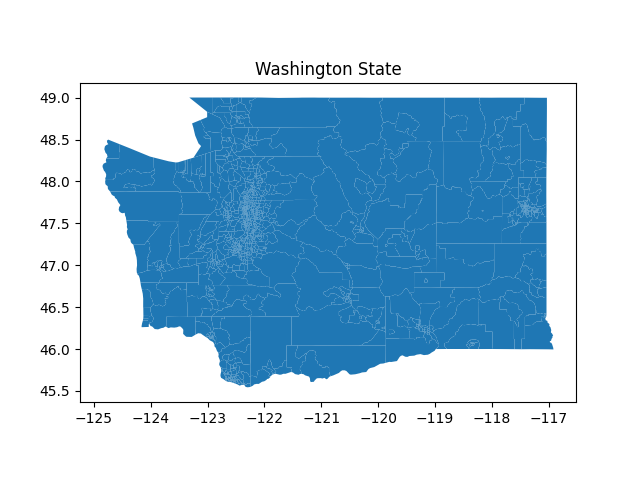
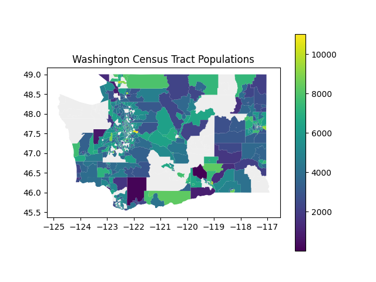
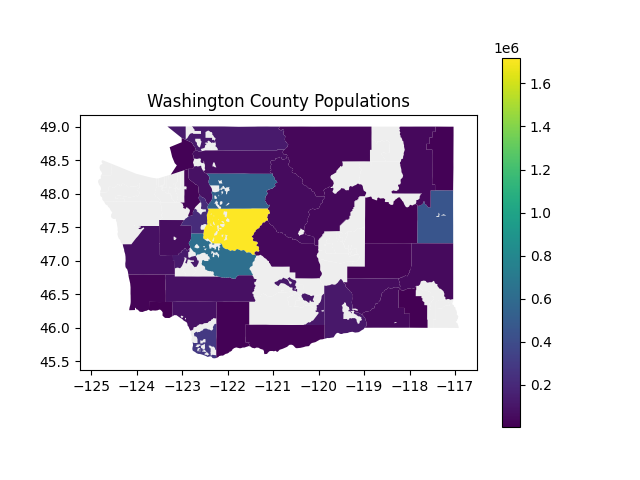
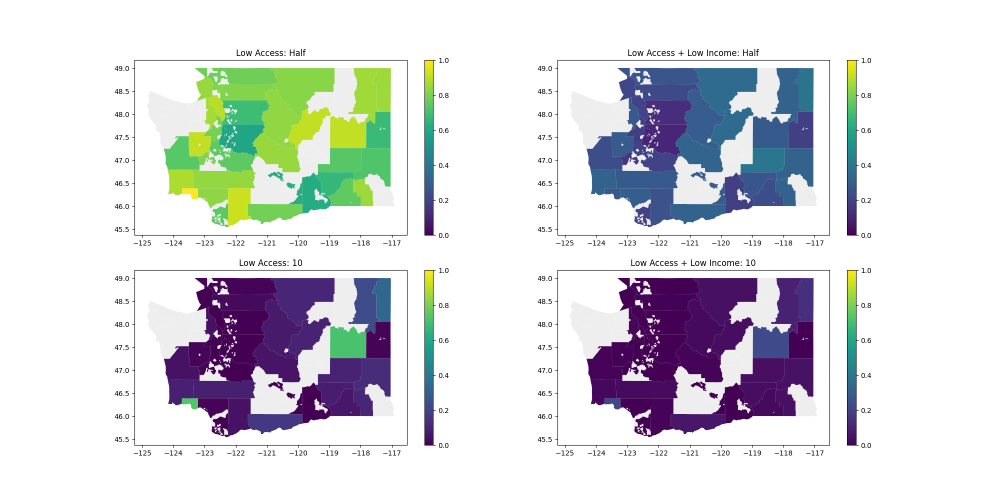
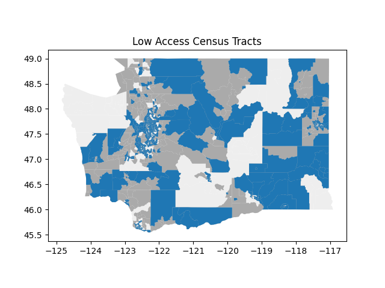

[](https://classroom.github.com/a/EMTLRsly)
# HW7 - Mapping

- [Overview](#overview)
  - [Learning Objectives](#learning-objectives)
  - [Expectations](#expectations)
- [Files & Data](#files--data)
  - [Provided Files](#provided-files)
  - [Data Description](#data-description)
  - [Rubric](#rubric)
- [Part 1: Processing Data](#part-1-processing-data)
  - [Part 1a: load_in_data](#part-1a-load_in_data---geodataframe)
  - [Part 1b: percentage_food_data](#part-1b-percentage_food_data---float)
- [Part 2: Plotting Data](#part-2-plotting-data)
  - [Comparing Plots](#comparing-plots)
  - [Part 2a: plot_map](#part-2a-plot_map)
  - [Part 2b: plot_population_map](#part-2b-plot_population_map)
  - [Part 2c: plot_population_county_map](#part-2c-plot_population_county_map)
  - [Part 2d: plot_food_access_by_county](#part-2d-plot_food_access_by_county)
  - [Part 2e: plot_low_access_tracts](#part-2e-plot_low_access_tracts)
- [Part 3: Writeup](#part-3-writeup)

## Overview
### Learning Objectives
In this assignment, you will analyze geospatial data to investigate food deserts in Washington State. You will demonstrate mastery in:
- **Merging datasets** using joins.
- **Visualizing geospatial data** with multiple layers on a map.
- **Interpreting library documentation** to effectively call functions.

You may want to read and learn what a food desert is [here](https://en.wikipedia.org/wiki/Food_desert)
* In essence, it is an area in which people do not have adequate access to nutritious/affordable food.

### Expectations
- Only use the following libraries: `math`, `pandas`, `geopandas`, and `matplotlib.pyplot`.
  - You do NOT need libraries like `seaborn` and **will be marked down for using other libraries.**
- No unit tests are required, but you must include a `main` method in `hw7.py` that follows the main method pattern and calls all written functions using the provided dataset.
- Do not use loops/list comprehensions and make unnecessary copies of the dataset using `.copy()`.
  - When plotting, a bit of redundancy is expected, but the point above remains.
- **You do not need to use `bbox_inches=tight` for any plot on this assignment.**
- Each method should have a **docstring** comment.
- **Do not** use plt.clf() - The tests rely on the figures returned from your plots to test with.

## Files & Data
### Provided Files
- **`cse163_imgd_NCHS.py`** – Utility functions for comparing images.
- **`hw7.py`** - The file where you will write your code plotting and processing data.
- **`hw7-writeup.md`** - The file where you will write your reflection answers for this assignment.

### Data Description
This assignment involves two datasets:
1. **`washington.json`** - A JSON file containing the Washington geometry
   - **`CTIDFP00`** – Census tract identifier (used for merging datasets).
   - **`geometry`** – Geospatial shape of the census tract.
   - Only includes census tracts in **Washington State**.
2. **`food_access.csv`** - A CSV file containing information on census tracts and food deserts
   - **`CensusTract`** – Census tract identifier (used for merging datasets).
   - **`County`**` - The County that this census tract is a part of
   - **`Urban`** - A flag for if the census tract is Urban (1=Yes, 0=No)
   - **`Rural`** - A flag for if the census tract is Rural (1=Yes, 0=No)
   - **`POP2010`** – Total population count for the census tract.
   - **`lapophalf`** – The number of people in an **urban** census tract who live more than **0.5 miles** from the nearest food source.
   - **`lapop10`** – The number of people in a **rural** census tract who live more than **10 miles** from the nearest food source.
   - **`lalowihalf`** – The number of **low-income** individuals in an **urban** census tract who live more than **0.5 miles** from the nearest food source.
   - **`lalowi10`** – The number of **low-income** individuals in a **rural** census tract who live more than **10 miles** from the nearest food source.

The four columns of `lapophalf`, `lapop10`, `lalowihalf`, and `lalowi10` can be somewhat confusing. Here's a way you could remember them:
* `lowi` = Low income individuals, while `pop` = All people
  * This means `pop` is more general, as it encompasses all people. So if the one with `pop` is NaN, the one with `lowi` will also be NaN.
* `10` = Lives more than 10 miles from nearest food source (Also indicates rural)
* `half` = Lives more than 0.5 miles from nearest food source (Also indicates urban)

### Rubric

The rubric for this project is available in the rubric.md document.

## Part 1: Processing Data

### Part 1a: load_in_data -> GeoDataFrame
Write a function called `load_in_data`.

Your objective here is to merge the two datasets from `food_access.csv` and `washington.json`. You will want to do it via their census tract identifiers (Look at the columns listed above to see which columns to merge). You should keep all the rows from the GeoDataFrame (think about what your `how` parameter should be).

This should return a GeoDataFrame with 1318 rows.

### Part 1b: percentage_food_data -> float
Write a function called `percentage_food_data` that takes the merged data from `load_in_data` as a parameter and returns the percentage of census tracts in Washington that we have food access data for. 
* This means you will have to filter the data; think about which columns you will have to check. 

The percentage you return should be a float between 0 and 100 (ex: 90.53). You do not need to truncate the float.

## Part 2: Plotting Data
### Comparing Plots

The file `cse_163_imgd_NCHS.py` contains a helper method called `compare_image` which will be useful. The plots you should produce are in the `expected/` directory. There is a folder called `compare/` which is empty until you call this method. Here's a way you could structure your main method in `hw7.py`:

```python
# other imports
from cse163_imgd_NCHS import compare_image
...
def plot_map(state_data):
   # Implementation not shown

def main():
    state_data = load_in_data(
        'food_access/washington.json',
        'food_access/food_access.csv'
    )
    plot_map(state_data) # Plots the image `map.png` in the project root directory
    compare_image('map.png')

if __name__ == '__main__':
    main()
```

All of your plots **must** be in the project root directory. After running this code, your result will be an image in `compare/` folder. This image comparison tool works by comparing the RGB values of every pixel in the image. **Any non-matching pixel will be marked by a bright red pixel**.
* If calling `compare_image` yields an error that the file does not exist, you probably have to add the `compare/` folder to the root directory of the project.

Note that you do **NOT** have to match exactly. Small red spots are _expected_, large red regions mean that your code needs some correction.

The expected image that should be produced for each plot is in `expected/` but will also be shown at the bottom of each part in this README.

### Part 2a: plot_map
Write a function called `plot_map` that takes the merged data as a parameter and plots a map of Washington. There is no need to customize this plot or add any data on top of it; it should just plot the shape of all the census tracts. The output should look like Washington state (e.g., it should have no "holes" in the map). 

The plot should be titled 'Washington State'.

You should save the plot in a file called `map.png`.



### Part 2b: plot_population_map
Write a function called `plot_population_map` that takes the merged data as a parameter and plots a map of Washington with each census tract _colored by its population_. 

**It is expected that there will be some missing census tracts.** Underneath the census tracts you should plot the map of Washington in #EEEEEE. 
* Plot the map of Washington FIRST. You can think of it like layering - you plot the map of Washington first, then plot the population second such that it layers over the Washington map.

You should also include a legend to indicate what the colors mean (the legend does not need to contain the background grey color). 

You should save the plot in a file called `population_map.png`.



### Part 2c: plot_population_county_map
Write a function called `plot_population_county_map` that takes the merged data as a parameter and plots a map of Washington with each county colored by its population. 

Remember that census tracts and counties are not the same. Counties contain census tracts-so you will need to aggregate the data by each county _(Hint: What function on a GeoDataFrame allows you to aggregate data by a column?)_

**It is expected that there will be some missing counties.** Underneath the census tracts you should plot the map of Washington in #EEEEEE. 

You should also include a legend to indicate what the colors mean (the legend does not need to contain the background grey color).

You should save the plot in a file called `county_population_map.png`.



### Part 2d: plot_food_access_by_county
For this problem, you will be writing a function called `plot_food_access_by_county that` takes the merged data as a parameter and makes various plots on the same figure showing information about food access and low income. You will have 4 subplots on this image-it's a little more complicated.

Make a copy of the GeoDataFrame that only has the columns 'County', 'geometry', 'POP2010', 'lapophalf', 'lapop10', 'lalowihalf', 'lalowi10'. Aggregate this dataset by county, summing up all of the numeric columns (same as what you did in part 2c).

Compute columns named `lapophalf_ratio`, `lapop10_ratio`, `lalowihalf_ratio`, `lalowi10_ratio` that store the ratio of people in that county that fall under each group respectively. These columns should be added to the local copy of the dataset.
* To help think about this ratio: You want the number of people under 'lapophalf', 'lapop10', etc, divided by the total number of people. Which column represents the total number of people?


Create a figure with subplots. To do this, you will use the following line of code which will create a figure with 4 separate axes to draw subplots.
```python
fig, [[ax1, ax2], [ax3, ax4]] = plt.subplots(2, 2, figsize=(20, 10))
```
This line of code looks complicated, but all you need to know is the variable fig stores a reference to the whole figure (i.e. the picture) and each of the variables that start with ax store a reference to one of sub-plot's axis.
* Think of the 2D array like this: ax1 is top-left, ax2 is top-right, ax3 is bottom-left, and ax4 is bottom-right.

Plot the map of Washington (like in part 2a) with the color #EEEEEE as the background in each subplot.
* This essentially means you will copy paste the same line 4 times, with the only different being the AxesSubplot object inputted.
* You should be using the `state_data` dataset like in part 2a, since it contains all your counties.

For each of the ratio columns you computed, you'll want to plot the dataset they're stored in. Specify the ax parameter, and include a legend. In order to keep the plots on the same scale, we'll also be passing in the `vmin` and `vmax` parameters (`vmin=0, vmax=1`)
* Once again, it's essentially the same line of code. Just remember to change the ratio column you're plotting (look at the expected plot and which ratio column matches)

Set the titles for each axis to match the expected image. For example, if you want to change the title of the top-left subplot you would write the line of code: 
```python
ax1.set_title('Foo')
```

You should save the plot in a file called `county_food_access.png`.



### Part 2e: plot_low_access_tracts
In this problem, we will plot all of the census tracts that are considered low access. You should write a function called `plot_low_access_tracts`. The definition for low access depends on whether or not the census tract is "urban". The data is set up so that each census tract is either "urban" or "rural".

* Urban: If the census tract is "urban", the distance of interest is half a mile from a food source. The threshold for low access in an urban census tract is **at least 500 people or at least 33% of the people in the census tract being more than half a mile from a food source**. An urban census tract that satisfies **either** of these conditions is considered low access.
* Rural (i.e. non-urban): If the census tract is "rural", the distance of interest is 10 miles from a food source. The threshold for low access in a rural census tract is **at least 500 people or at least 33% of the people in the census tract being more than 10 miles from a food source**. A rural census tract that satisfies **either** of these conditions is considered low access.

Remember that there are the `Urban` and `Rural` columns in the GeoDataFrame that serve as flags. You will want to filter by these columns. However, it is not this simple - you will have to consider the definitions above in combination with these flags.
* Think about how you will structure your mask.


Because of how the plots are layered (as discussed in part 2b), you should plot the data in the following order:
- First, plot all of the census tracts. You should pass in `color='#EEEEEE'` when plotting to make the census tracts a light gray.
- Second, plot all of the census tracts that we have food access data for. You should pass in `color='#AAAAAA'` when plotting to make these census tracts a dark gray.
- Third, plot all of the census tracts that your computation has considered "low access". You should not pass in a color for this plot so that the low access census tracts are highlighted blue (blue is the default color).

Note: For this problem, you are **NOT** allowed to use the 'LATracts_half' or 'LATracts10' columns since we are trying to compute something similar to these (although not exactly the same).

You should save the plot in a file called `low_access.png`.



## Part 3: Writeup
To wrap-up this assignment, you will be answering two questions in the file `hw7-writeup.md`. 

Your answers should be concise and specific. Question #1 should be a combined 3-5 sentences, while question #2 should be about 2-3 sentences. 

You **MUST** use Markdown in your answers. It's the same thing that these README instructions have been written in; feel free to look through it for inspiration, _or_ look online at some guides. Don't be excessive, but make sure you highlight key words of your answers appropriately.

Ensure you've committed all your changes.


